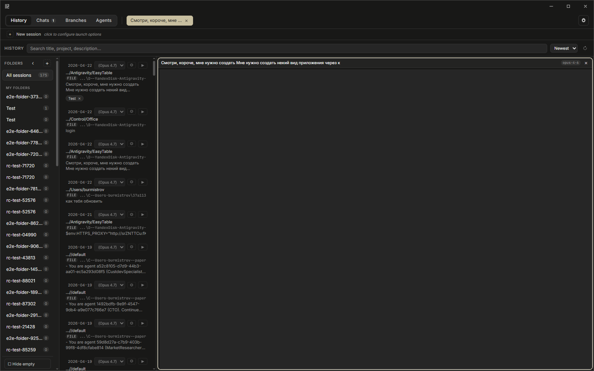
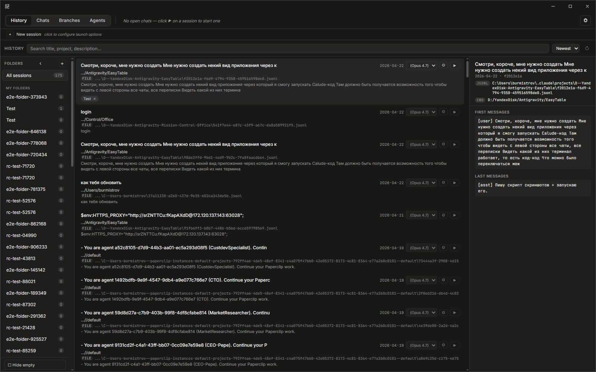
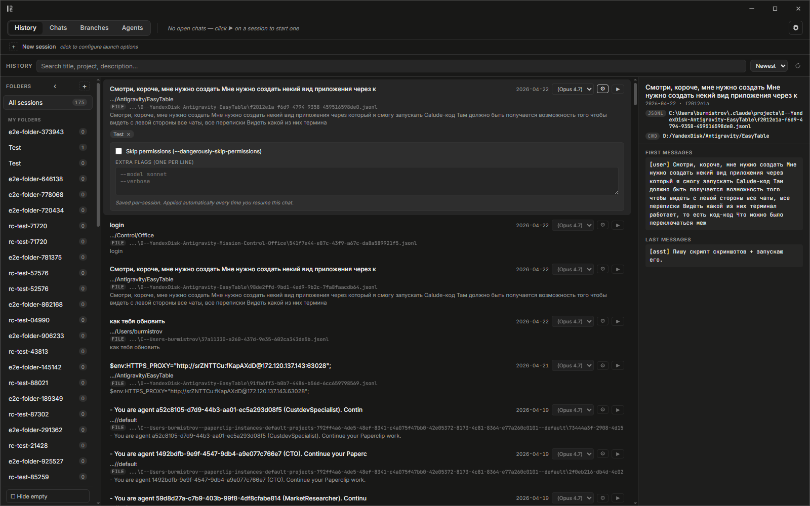
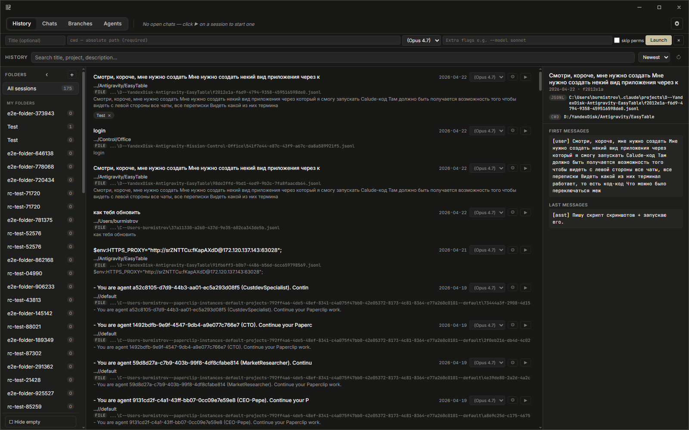
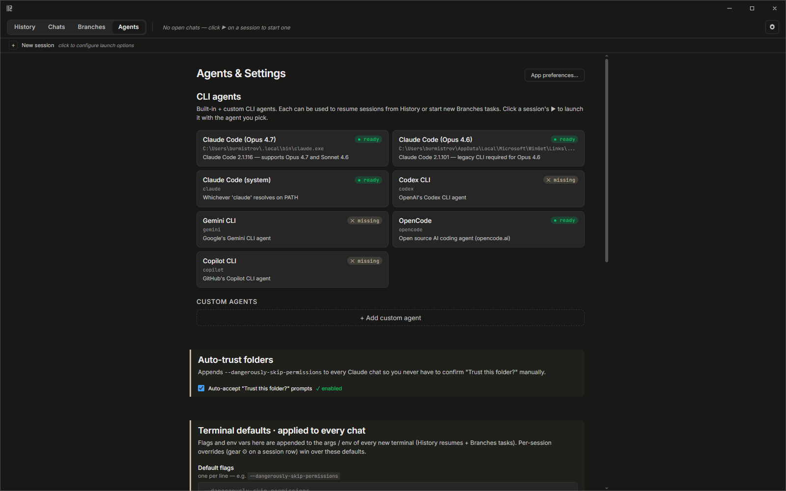

<h1 align="center">ClaudeDesk</h1>

<p align="center">
  <b>A desktop cockpit for Claude Code sessions.</b><br/>
  Every dialog on your machine in one window — browsable, resumable, organizable, side-by-side.
</p>

<p align="center">
  
  
  
  
  
  <a href="https://github.com/kymaman/claudedesk/releases/latest"></a>
</p>

<p align="center">
  
</p>

---

## Why

Claude Code keeps every session as a JSONL file in `~/.claude/projects/<cwd-hash>/<uuid>.jsonl`. After a few weeks of work you end up with **hundreds of sessions** across a dozen projects — and the CLI only lets you `claude --resume` one at a time.

ClaudeDesk surfaces all of them, adds organization on top, and spawns live xterm tiles side-by-side so you can hop between chats or run several in parallel without losing context.

## Highlights

- **History sidebar** — indexes every `.jsonl` across `~/.claude/projects` (and any extra folders you point at). Titles + short summaries come from `SESSIONS_INDEX.md`; anything missing falls back to a JSONL parser that pulls the first user message / built-in `summary` record. Results cache in SQLite so the second scan is instant.
- **Click → resume in a terminal** — opens as a *Chat* (not a worktree task), so you can open as many as you want without the `hasDirectTask` collision. Each tile keeps its own xterm, closing one never touches the others.
- **Per-session launch options** — gear ⚙ on each row: pick agent version, add extra flags (one per line), toggle skip-permissions. Persisted in SQLite, applied every time you resume that exact session.
- **Global terminal defaults** — Agents tab → flags + env vars (proxy, API keys, anything) merged into every new terminal. Per-session overrides win.
- **Auto-trust folders** — global toggle adds `--dangerously-skip-permissions` and additionally watches terminal output for interactive "Trust this folder?" prompts and presses Enter automatically.
- **Folders** — custom folders with drag-and-drop, pin-to-top, inline rename, right-click delete, + auto smart-groups by project cwd. Hide-empty toggle keeps the rail clean.
- **Filters** — sort by Newest / Oldest / Project / Title, hide noisy projects with one click.
- **Side-by-side layout** — first chat → folders + sessions rail stay on the left (160 + 260 px), xterm fills the rest of the window. Up to 12 tiles in one window; beyond that, a new window is on the roadmap.
- **CLI version picker** — drop-down per session for Opus 4.7 (Claude Code 2.1.116) vs Opus 4.6 (legacy 2.1.101). Your own custom agents supported too.
- **Right-click delete** — `Delete from view` (reversible, local) or `Delete permanently` (removes the JSONL file + local metadata).
- **Nothing-style dark theme** + full Cyrillic support via self-hosted JetBrains Mono so Russian characters don't jitter in xterm.

## Screenshots

| History (hover to preview) | Launch options per session |
| --- | --- |
|  |  |

| + New session bar | Chat tile + sessions rail |
| --- | --- |
|  |  |

| Agents & Settings |
| --- |
|  |

## Install

### Windows (NSIS installer)

1. Grab the latest `ClaudeDesk Setup x.y.z.exe` from [Releases](https://github.com/kymaman/claudedesk/releases/latest).
2. Run it. Windows SmartScreen may warn that the installer is unsigned — "More info" → "Run anyway".
3. NSIS installs to `%LOCALAPPDATA%\Programs\ClaudeDesk` and creates a Start menu + Desktop shortcut.

The app expects at least one Claude Code binary on the machine. The built-in agents look for:

- `%USERPROFILE%\.local\bin\claude.exe` (default for `npm install -g @anthropic-ai/claude-code`)
- `%USERPROFILE%\AppData\Local\Microsoft\WinGet\Links\claude.exe` (winget)
- `claude` on PATH (falls back to whatever your shell resolves)

Any custom path? Agents tab → **Custom agents** → add your binary with a name + args.

### macOS / Linux

Inherited from the upstream project (parallel-code supports both). Building from source works; pre-built DMG / AppImage are not published yet.

## Build from source

```bash
git clone https://github.com/kymaman/claudedesk.git
cd claudedesk
npm install          # runs electron-rebuild for better-sqlite3 automatically
npm run dev          # Vite + Electron in watch mode
npm run build        # produces release/ with an NSIS installer on Windows
```

Requirements: Node 20+, Git 2.40+, Visual Studio Build Tools (only if `better-sqlite3` needs to rebuild).

## Testing

```bash
npm test             # unit tests — 191 passing
npm run test:e2e     # Playwright suite drives the packaged Electron app
```

The Playwright suite (`e2e/smoke.spec.ts`) covers the full UX: launching the app, switching tabs, opening a chat with a real xterm, right-click delete menu, folder create, launch-options gear, etc. It's how regressions get caught before a release.

## Tech stack

| Layer | What |
| --- | --- |
| Shell | [Electron 40](https://www.electronjs.org/) |
| Renderer | [SolidJS 1.9](https://www.solidjs.com/) + Vite 7 + TypeScript 5.9 |
| Terminal | [xterm.js 6](https://xtermjs.org/) + `@xterm/addon-fit`, `@xterm/addon-webgl` |
| PTY | [node-pty](https://github.com/microsoft/node-pty) |
| Storage | [better-sqlite3](https://github.com/WiseLibs/better-sqlite3) (sessions db) + localStorage (UI prefs) |
| Testing | [Vitest](https://vitest.dev/) + [Playwright](https://playwright.dev/) (Electron driver) |

## Credits

ClaudeDesk is a **fork of [parallel-code](https://github.com/johannesjo/parallel-code) by Johannes Millan** ([@johannesjo](https://github.com/johannesjo)) — MIT-licensed. Parallel-code contributed the entire base of this project:

- Electron + SolidJS scaffold
- node-pty multiplexer + xterm.js integration
- Git-worktree isolation system (preserved in the `Branches` tab)
- Tiled panel layout engine
- Autosave, keybindings, Monaco diff editor
- Remote-access companion (QR code, Tailscale/Wi-Fi mirror)

On top of that, ClaudeDesk adds the History-centric UX, session indexer (JSONL fallback parser + SQLite cache), custom folders, filters, per-session launch options, chats system decoupled from worktrees, auto-trust watcher, `+ New session` bar, screenshots pipeline, and a Playwright E2E suite covering the whole flow. Thanks Johannes for the foundation.

Additional acknowledgements:

- [xterm.js](https://github.com/xtermjs/xterm.js) contributors for the terminal emulator
- [JetBrains Mono](https://www.jetbrains.com/lp/mono/) for the only font with Cyrillic coverage that doesn't jitter in xterm
- [Nothing Design skill](https://github.com/dominikmartn/nothing-design-skill) for the OLED-black look inspiration

## License

MIT, inherited from [parallel-code](https://github.com/johannesjo/parallel-code/blob/main/LICENSE). See [`LICENSE`](LICENSE).
